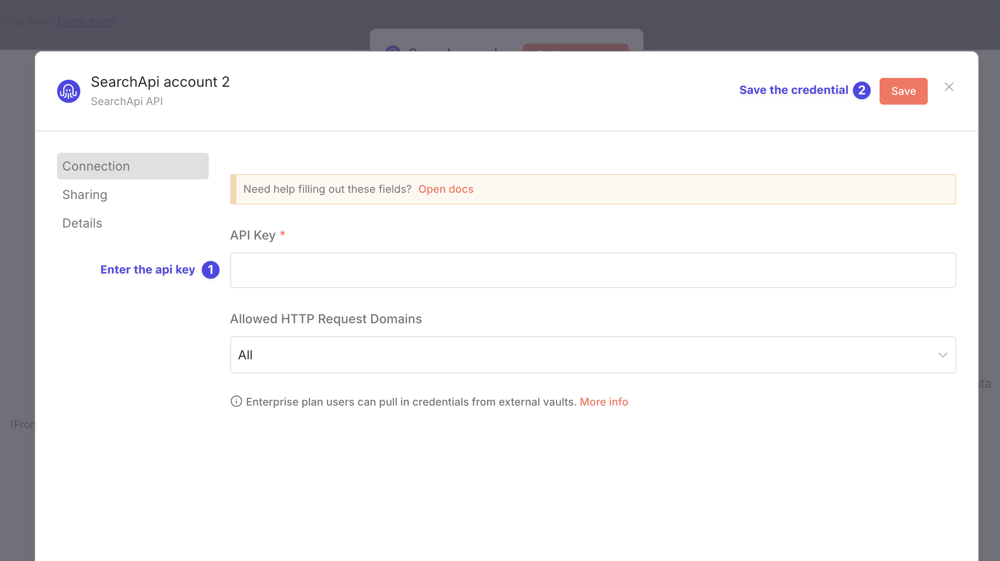
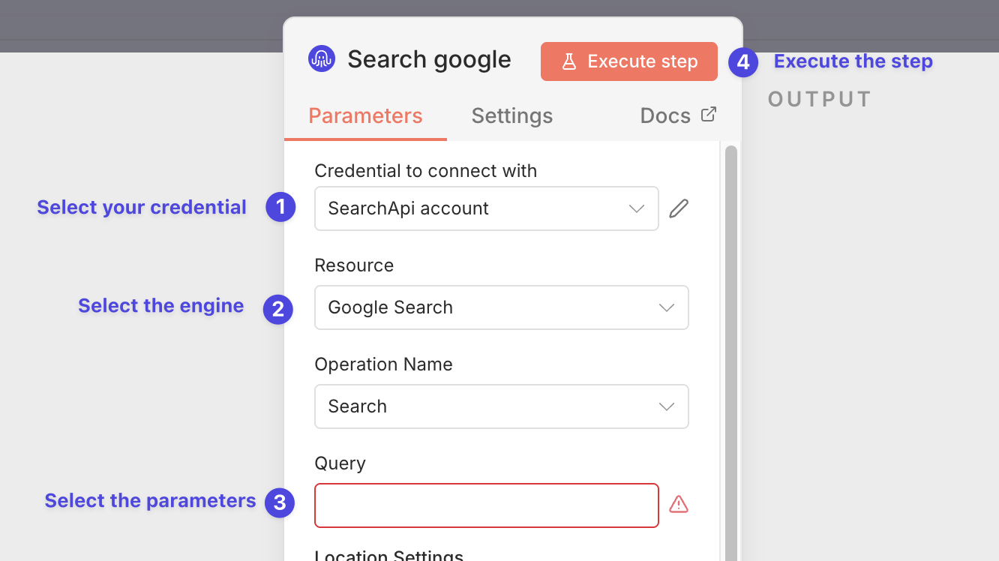

# n8n-nodes-searchapi

SearchApi is a fast, reliable SERP and data extraction API that focuses on performance, parsing quality, and competitive pricing. We offer realtime structured data from many different sources like Google, Bing, Amazon and others...

[Installation](#installation)  
[Operations](#operations)  
[Credentials](#credentials)  <!-- delete if no auth needed -->  
[Compatibility](#compatibility)  
[Usage](#usage)  <!-- delete if not using this section -->  
[Resources](#resources)  
[Version history](#version-history)  <!-- delete if not using this section -->  
[Troubleshooting](#troubleshooting)  
[Development](#development)

## Installation

Follow the [installation guide](https://docs.n8n.io/integrations/community-nodes/installation/) in the n8n community nodes documentation.

## Operations

The node supports one main operation: `Search`. You can use it to search from all of the supported engines.

## Credentials

1. Sign up at **[SearchApi.io](https://www.searchapi.io/)** and copy your **API Key**.
2. In n8n go to **Credentials → + New Credential → SearchApi**.
3. Paste the key and save.\
   The new credential will now appear in the node’s **Credential** dropdown.

## Usage

### Credentials

1. Go to **Credentials → + New Credential → SearchApi**.
2. Paste the **API Key**.
3. Click **Save**.

### Search

1. Create a SearchApi credential in n8n.
2. Go to the **SearchApi** node and select your **Credential**.
3. Select the **Engine** you want to use. 
4. Enter the parameters for the engine. After selection, you will see the parameters for the engine. There are also optional parameters that you can use to further refine your search.
5. Click **Execute** to receive the response as JSON.

## Resources

- **SearchApi.io documentation** – [https://www.searchapi.io/](https://www.searchapi.io/docs/google)
- **n8n Community Nodes Documentation** – [https://docs.n8n.io/integrations/#community-nodes](https://docs.n8n.io/integrations/#community-nodes)
- **n8n Community Forum** – [https://community.n8n.io](https://community.n8n.io)

## Troubleshooting

| Error message                | Likely cause                 | Fix                                                                         |
| ---------------------------- | ---------------------------- | --------------------------------------------------------------------------- |
| **401 Unauthorized**         | Invalid or missing API key   | Double‑check the credentials.                                           |
| **429 Too Many Requests**    | Rate limit exceeded          | Slow down the workflow or [upgrade plan](https://www.searchapi.io/pricing). |

## Version history

You can see the version history [here](https://github.com/SearchApi/n8n-nodes-searchapi/releases).

## Development

1. Run `npm install` to install the dependencies
2. Run `npm run dev` to start the development server

You will be able to see the the node in the local n8n http://localhost:5678.

Obs: You might need to run `rm -rf ~/.n8n-node-cli`, to clear the cache of old n8n instances you might have installed, it might make the cli to timeout.
