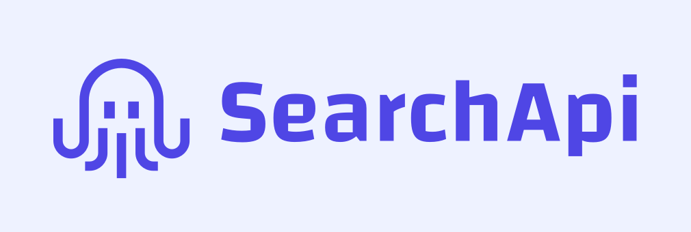
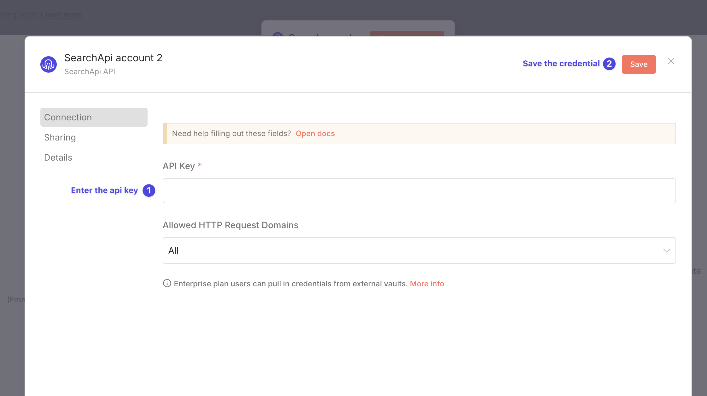
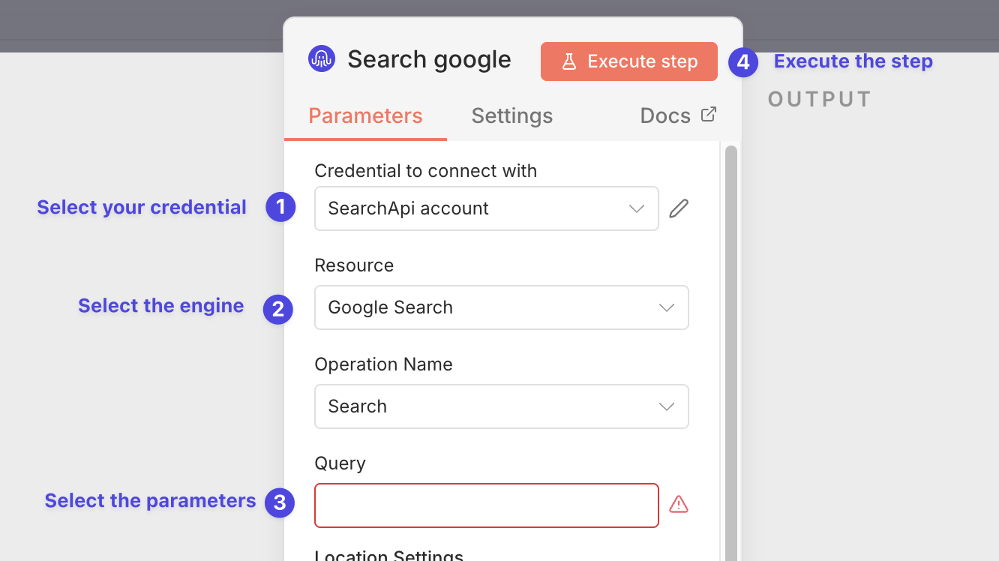

# n8n-nodes-searchapi

SearchApi is a fast, reliable SERP and data extraction API that focuses on performance, parsing quality, and competitive pricing. We offer realtime structured data from many different sources like Google, Bing, Amazon and others...

- [Installation](#installation)
- [Operations](#operations)
- [Credentials](#credentials)
- [Usage](#usage)
- [Resources](#resources)
- [Version history](#version-history)
- [Troubleshooting](#troubleshooting)
- [Development](#development)

## Installation

### Option 1 — Install from the nodes panel (recommended)

SearchApi is a verified community node. On recent n8n versions (1.94+, self-hosted or Cloud):

1. Open the **Nodes panel** and search for **SearchApi**.
2. Select the node and click **Install**.

### Option 2 — Install by npm package name (self-hosted only)

1. Go to **Settings → Community Nodes → Install**.
2. Enter the full scoped package name: `@searchapi/n8n-nodes-searchapi`
3. Agree to the risks and click **Install**.

> **Note:** the package name is scoped (it starts with `@searchapi/`). Older n8n versions had issues installing scoped community packages — see [Troubleshooting](#troubleshooting) if the install fails with a `tar` error.

For more details, follow the [installation guide](https://docs.n8n.io/integrations/community-nodes/installation/) in the n8n community nodes documentation.

## Operations

The node supports one main operation: `Search`. You can use it to search from all of the supported engines.

## Credentials

1. Sign up at **[SearchApi.io](https://www.searchapi.io/)** and copy your **API Key**.
2. In n8n go to **Credentials → + New Credential → SearchApi**.
3. Paste the key and save.\
   The new credential will now appear in the node’s **Credential** dropdown.

## Usage

### Credentials

1. Go to **Credentials → + New Credential → SearchApi**.
2. Paste the **API Key**.
3. Click **Save**.



### Search

1. Create a SearchApi credential in n8n.
2. Go to the **SearchApi** node and select your **Credential**.
3. Select the **Engine** you want to use.
4. Enter the parameters for the engine. After selection, you will see the parameters for the engine. There are also optional parameters that you can use to further refine your search.
5. Click **Execute** to receive the response as JSON.



## Resources

- **SearchApi.io documentation** – [https://www.searchapi.io/](https://www.searchapi.io/docs/google)
- **n8n Community Nodes Documentation** – [https://docs.n8n.io/integrations/#community-nodes](https://docs.n8n.io/integrations/#community-nodes)
- **n8n Community Forum** – [https://community.n8n.io](https://community.n8n.io)

## Troubleshooting

| Error message                | Likely cause                 | Fix                                                                         |
| ---------------------------- | ---------------------------- | --------------------------------------------------------------------------- |
| **401 Unauthorized**         | Invalid or missing API key   | Double‑check the credentials.                                           |
| **429 Too Many Requests**    | Rate limit exceeded          | Slow down the workflow or [upgrade plan](https://www.searchapi.io/pricing). |
| **Error loading package … `tar … Cannot open: No such file or directory`** | Older n8n versions fail to prepare the target directory for **scoped** packages (`@searchapi/…`) before extracting | See [Installation fails with a `tar` error](#installation-fails-with-a-tar-error) below. |

### Installation fails with a `tar` error

On some older n8n versions, installing this node via **Settings → Community Nodes** fails with:

```
Error loading package "@searchapi/n8n-nodes-searchapi": Command failed: tar -xzf searchapi-n8n-nodes-searchapi-<version>.tgz -C <...>
tar: <...>/node_modules/@searchapi/n8n-nodes-searchapi: Cannot open: No such file or directory
```

This is not specific to SearchApi: those n8n versions don't create the nested target directory that **scoped** package names (`@scope/name`) require before running `tar`, so the extraction fails. Unscoped packages are unaffected, which is why the error can look SearchApi-specific.

**Fixes (any one of these):**

1. **Update n8n** to a recent version — current versions create the package directory correctly.
2. **Install from the Nodes panel instead** (see [Installation](#installation), Option 1): search for "SearchApi" and click Install. This verified-node path is the recommended installation method.

If the error persists on a current n8n version, please [open an issue](https://github.com/SearchApi/n8n-nodes-searchapi/issues) and include your n8n version and hosting setup (self-hosted or Cloud).

## Version history

You can see the version history [here](https://github.com/SearchApi/n8n-nodes-searchapi/releases).

## Development

1. Run `npm install` to install the dependencies
2. Run `npm run dev` to start n8n with the node in development mode
3. Open http://localhost:5678 to access n8n with the node loaded
4. Make changes to the source files — the node rebuilds automatically on file changes

Other useful commands:

- `npm run build` — compile TypeScript for production
- `npm run lint` — run ESLint code quality checks
- `npm run lint:fix` — auto-fix linting issues
- `npm run release` — bump version, update changelog, and publish to npm

You will be able to see the the node in the local n8n http://localhost:5678.

Obs: You might need to run `rm -rf ~/.n8n-node-cli`, to clear the cache of old n8n instances you might have installed, it might make the cli to timeout.
