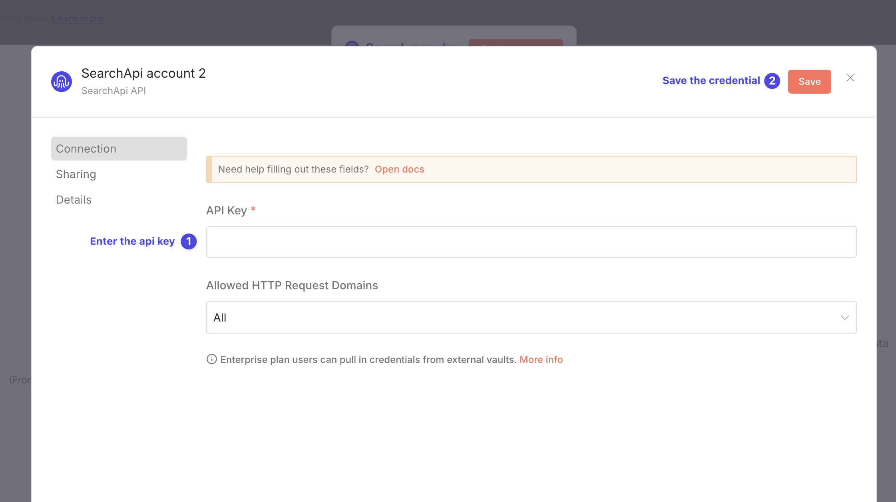
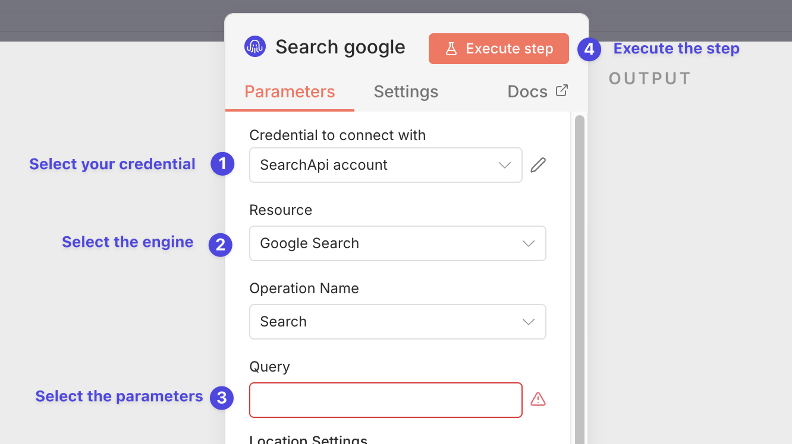

# n8n-nodes-searchapi

SearchApi is a fast, reliable SERP and data extraction API that focuses on performance, parsing quality, and competitive pricing. We offer realtime structured data from many different sources like Google, Bing, Amazon and others...

- [Installation](#installation)
- [Operations](#operations)
- [Credentials](#credentials)
- [Usage](#usage)
- [Resources](#resources)
- [Version history](#version-history)
- [Troubleshooting](#troubleshooting)
- [Development](#development)

## Installation

1. Open the **nodes panel** (`+` or press `N`).
2. Search for **SearchApi** — it's a verified node, so it shows up with an **Install** button.
3. Click **Install**, then **Add to workflow**.

Need a specific version, or installing on a restricted/headless instance? Go to **Settings → Community nodes**, enter package name `@searchapi/n8n-nodes-searchapi` (or pin a version with `@searchapi/n8n-nodes-searchapi@2.0.4`). See the [installation guide](https://docs.n8n.io/integrations/community-nodes/installation/) for details.

## Operations

The node supports one main operation: `Search`. You can use it to search from all of the supported engines.

## Credentials

1. Sign up at **[SearchApi.io](https://www.searchapi.io/)** and copy your **API Key**.
2. In n8n go to **Credentials → + New Credential → SearchApi**.
3. Paste the key and save.\
   The new credential will now appear in the node’s **Credential** dropdown.

## Usage

### Credentials

1. Go to **Credentials → + New Credential → SearchApi**.
2. Paste the **API Key**.
3. Click **Save**.

### Search

1. Create a SearchApi credential in n8n.
2. Go to the **SearchApi** node and select your **Credential**.
3. Select the **Engine** you want to use.
4. Enter the parameters for the engine. After selection, you will see the parameters for the engine. There are also optional parameters that you can use to further refine your search.
5. Click **Execute** to receive the response as JSON.

## Resources

- **SearchApi.io documentation** – [https://www.searchapi.io/](https://www.searchapi.io/docs/google)
- **n8n Community Nodes Documentation** – [https://docs.n8n.io/integrations/#community-nodes](https://docs.n8n.io/integrations/#community-nodes)
- **n8n Community Forum** – [https://community.n8n.io](https://community.n8n.io)

## Troubleshooting

| Error message                | Likely cause                 | Fix                                                                         |
| ---------------------------- | ---------------------------- | --------------------------------------------------------------------------- |
| **401 Unauthorized**         | Invalid or missing API key   | Double‑check the credentials.                                           |
| **429 Too Many Requests**    | Rate limit exceeded          | Slow down the workflow or [upgrade plan](https://www.searchapi.io/pricing). |
| **Error loading package / tar ... No such file or directory** | Install failed for the scoped npm package | Prefer installing via the nodes panel (search "SearchApi"). If installing manually, use the full package name `@searchapi/n8n-nodes-searchapi` and retry after clearing the n8n community-node cache. |
| **Node not available as AI tool** | Community tool usage disabled | On self-hosted n8n, set `N8N_COMMUNITY_PACKAGES_ALLOW_TOOL_USAGE=true` ([n8n docs](https://docs.n8n.io/hosting/configuration/environment-variables/nodes/)) and restart n8n. Re-install/reload the node after enabling. |

## Version history

You can see the version history [here](https://github.com/SearchApi/n8n-nodes-searchapi/releases).

## Development

1. Run `npm install` to install the dependencies
2. Run `npm run dev` to start n8n with the node in development mode
3. Open http://localhost:5678 to access n8n with the node loaded
4. Make changes to the source files — the node rebuilds automatically on file changes

Other useful commands:

- `npm run build` — compile TypeScript for production
- `npm run lint` — run ESLint code quality checks
- `npm run lint:fix` — auto-fix linting issues
- `npm run check:enums` — validate shared enumerations (runs in CI)
- `npm run generate:labels` — regenerate `nodes/SearchApi/shared/labels.ts`
- `npm run release` — bump version, update changelog, and publish to npm
